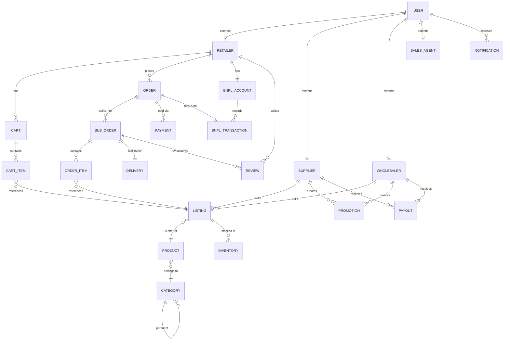

# Entity Relationship Diagram (ERD)
## B2B FMCG Marketplace App

**Version:** 1.0
**Status:** Draft

---

## 1. Overview

This document defines the core data model for the platform: entities, their attributes, and relationships. It is designed for a relational database (PostgreSQL recommended) given the transactional, multi-party nature of orders, inventory, and payments.

---

## 2. Entity List

| Entity | Description |
|---|---|
| `User` | Base identity record for anyone logging into the platform |
| `Retailer` | Retailer-specific profile linked to a User |
| `Supplier` | Supplier/brand-specific profile linked to a User |
| `Wholesaler` | Wholesaler-specific profile linked to a User |
| `SalesAgent` | Internal field agent profile linked to a User |
| `Product` | Master catalog item (brand-level product definition) |
| `Listing` | A specific seller's (supplier/wholesaler) offer of a Product, with price & stock |
| `Category` | Product categorization (hierarchical) |
| `Inventory` | Stock levels per Listing per warehouse/location |
| `Cart` | Retailer's active cart |
| `CartItem` | Line item within a Cart |
| `Order` | A retailer's order, may split into multiple SubOrders (one per supplier) |
| `SubOrder` | Order segment fulfilled by a single Supplier/Wholesaler |
| `OrderItem` | Line item within a SubOrder |
| `Payment` | Payment record tied to an Order |
| `BNPLAccount` | Retailer's Buy-Now-Pay-Later credit account |
| `BNPLTransaction` | Individual BNPL draw/repayment record |
| `Delivery` | Delivery/fulfillment record tied to a SubOrder |
| `Review` | Rating/review left by a Retailer |
| `Promotion` | Discount/promo campaign created by a Supplier |
| `Payout` | Settlement record from Platform to Supplier/Wholesaler |
| `Notification` | Notification log sent to a User |

---

## 3. Entity Attributes

### User
- `user_id` (PK)
- `phone_number` (unique)
- `email` (nullable)
- `password_hash` (nullable, if OTP-only)
- `role` (enum: retailer, supplier, wholesaler, sales_agent, admin)
- `status` (active, suspended, pending_verification)
- `created_at`, `updated_at`

### Retailer
- `retailer_id` (PK, FK → User)
- `business_name`
- `business_type` (shop, cafe, restaurant, etc.)
- `address`
- `city_id` (FK → City)
- `location_lat`, `location_lng`
- `credit_tier` (for BNPL eligibility)
- `assigned_agent_id` (FK → SalesAgent, nullable)

### Supplier
- `supplier_id` (PK, FK → User)
- `company_name`
- `business_registration_no`
- `kyc_status` (pending, verified, rejected)
- `city_id` (FK → City)
- `payout_account_info`

### Wholesaler
- `wholesaler_id` (PK, FK → User)
- `company_name`
- `warehouse_address`
- `kyc_status`
- `city_id` (FK → City)
- `payout_account_info`

### SalesAgent
- `agent_id` (PK, FK → User)
- `assigned_region_id`
- `manager_id` (nullable, self-referencing)

### Category
- `category_id` (PK)
- `name`
- `parent_category_id` (nullable, self-referencing for hierarchy)

### Product
- `product_id` (PK)
- `name`
- `brand`
- `category_id` (FK → Category)
- `unit_of_measure` (e.g., carton, pack, kg)
- `description`
- `image_url`

### Listing
- `listing_id` (PK)
- `product_id` (FK → Product)
- `seller_id` (FK → Supplier or Wholesaler — polymorphic, or split into two nullable FKs)
- `seller_type` (enum: supplier, wholesaler)
- `price`
- `min_order_qty`
- `is_active`
- `created_at`, `updated_at`

### Inventory
- `inventory_id` (PK)
- `listing_id` (FK → Listing)
- `warehouse_location`
- `quantity_available`
- `last_updated_at`

### Cart
- `cart_id` (PK)
- `retailer_id` (FK → Retailer)
- `created_at`, `updated_at`

### CartItem
- `cart_item_id` (PK)
- `cart_id` (FK → Cart)
- `listing_id` (FK → Listing)
- `quantity`

### Order
- `order_id` (PK)
- `retailer_id` (FK → Retailer)
- `order_status` (placed, confirmed, partially_fulfilled, completed, cancelled)
- `total_amount`
- `payment_method` (cod, card, wallet, bnpl)
- `created_at`, `updated_at`

### SubOrder
- `sub_order_id` (PK)
- `order_id` (FK → Order)
- `seller_id` (FK → Supplier or Wholesaler)
- `seller_type` (enum: supplier, wholesaler)
- `status` (pending, confirmed, packed, out_for_delivery, delivered, cancelled, returned)
- `subtotal_amount`

### OrderItem
- `order_item_id` (PK)
- `sub_order_id` (FK → SubOrder)
- `listing_id` (FK → Listing)
- `quantity`
- `unit_price`
- `line_total`

### Payment
- `payment_id` (PK)
- `order_id` (FK → Order)
- `amount`
- `method` (cod, card, wallet, bnpl)
- `status` (pending, completed, failed, refunded)
- `transaction_reference`
- `paid_at`

### BNPLAccount
- `bnpl_account_id` (PK)
- `retailer_id` (FK → Retailer)
- `credit_limit`
- `available_credit`
- `status` (active, suspended, defaulted)

### BNPLTransaction
- `bnpl_transaction_id` (PK)
- `bnpl_account_id` (FK → BNPLAccount)
- `order_id` (FK → Order, nullable for repayments)
- `type` (draw, repayment)
- `amount`
- `due_date`
- `paid_date` (nullable)
- `status` (pending, paid, overdue)

### Delivery
- `delivery_id` (PK)
- `sub_order_id` (FK → SubOrder)
- `delivery_partner_type` (wholesaler_fleet, third_party)
- `driver_name` (nullable)
- `tracking_status`
- `estimated_delivery_time`
- `actual_delivery_time`

### Review
- `review_id` (PK)
- `retailer_id` (FK → Retailer)
- `sub_order_id` (FK → SubOrder)
- `rating` (1-5)
- `comment`
- `created_at`

### Promotion
- `promotion_id` (PK)
- `seller_id` (FK → Supplier or Wholesaler)
- `listing_id` (FK → Listing, nullable if category-wide)
- `discount_type` (percentage, fixed_amount)
- `discount_value`
- `start_date`, `end_date`

### Payout
- `payout_id` (PK)
- `seller_id` (FK → Supplier or Wholesaler)
- `amount`
- `period_start`, `period_end`
- `status` (pending, paid)
- `paid_at`

### Notification
- `notification_id` (PK)
- `user_id` (FK → User)
- `type` (order_update, promotion, payment_reminder)
- `message`
- `is_read`
- `created_at`

### City (supporting lookup entity)
- `city_id` (PK)
- `name`
- `country`

---

## 4. Relationships Summary

- `User` 1—1 `Retailer` / `Supplier` / `Wholesaler` / `SalesAgent` (role-specific profile extension)
- `Retailer` 1—N `Cart` (typically 1 active cart) → `CartItem` N—1 `Listing`
- `Retailer` 1—N `Order`
- `Order` 1—N `SubOrder` (one per seller in that order)
- `SubOrder` 1—N `OrderItem` N—1 `Listing`
- `Listing` N—1 `Product`, N—1 Supplier/Wholesaler (seller)
- `Listing` 1—N `Inventory` (per warehouse location)
- `Order` 1—N `Payment`
- `Retailer` 1—1 `BNPLAccount` 1—N `BNPLTransaction`
- `SubOrder` 1—1 `Delivery`
- `SubOrder` 1—N `Review` (retailer reviews the fulfillment)
- Supplier/Wholesaler 1—N `Promotion`
- Supplier/Wholesaler 1—N `Payout`
- `User` 1—N `Notification`
- `Category` 1—N `Category` (self-referencing hierarchy), 1—N `Product`

---

## 5. Entity Relationship Diagram (Mermaid)

---

## 6. Notes & Design Decisions

- **Polymorphic seller reference**: `Listing`, `Promotion`, and `Payout` reference either a `Supplier` or `Wholesaler` via `seller_id` + `seller_type`. In implementation, this can be modeled as two nullable FK columns with a check constraint, or a shared `Seller` supertype table — recommend the shared supertype approach for cleaner joins at scale.
- **Order splitting**: A single `Order` can span multiple sellers; `SubOrder` is the unit of fulfillment, payout, delivery, and review — mirrors how Cartona-style marketplaces route items to different suppliers/wholesalers within one retailer checkout.
- **BNPL as a bolt-on**: Modeled so it can be swapped for a 3rd-party fintech provider's API without restructuring the Order/Payment core — `BNPLAccount`/`BNPLTransaction` can become a synced mirror of an external system.
- **City** is a lightweight lookup table to support multi-city rollout and regional analytics.
