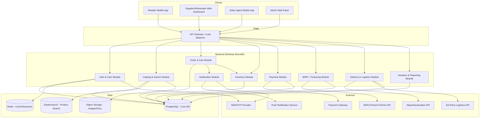
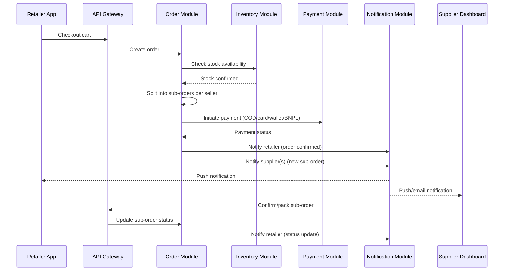

# System Design & Architecture
## B2B FMCG Marketplace App

**Version:** 1.0
**Status:** Draft

---

## 1. Architecture Style

**Recommendation: Modular monolith first, evolve to microservices later.**

Given the team is likely small at MVP stage, a modular monolith (single deployable backend, but organized into clear domain modules) lets you move fast without the operational overhead of microservices. Split into services later (order processing, payments, inventory, notifications) once you have real scale/team-size pressure. Cartona-scale platforms eventually run distributed services, but don't start there.



---

## 2. Client Applications

| App | Platform | Tech Recommendation |
|---|---|---|
| Retailer App | iOS + Android | React Native (or Flutter) |
| Supplier/Wholesaler Dashboard | Web (responsive) | React + TypeScript |
| Sales Agent App | Android-first (field use) | React Native (shared codebase with retailer app where possible) |
| Admin Panel | Web | React + TypeScript, internal-only auth |

**Why React Native for mobile:** single codebase for iOS/Android, large ecosystem, easy to share business logic/types with the web dashboards if using TypeScript across the stack.

---

## 3. Backend Modules

| Module | Responsibility |
|---|---|
| **Auth & User** | Registration, OTP verification, role-based access control, KYC status for suppliers/wholesalers |
| **Catalog & Search** | Product/category management, listings, search & filtering (Elasticsearch-backed) |
| **Order & Cart** | Cart management, checkout, order splitting into sub-orders, order state machine |
| **Inventory** | Real-time stock tracking per listing/warehouse, low-stock alerts |
| **Payment** | Payment gateway integration, transaction records, refunds |
| **BNPL/Financing** | Credit account management, draw/repayment tracking, integration with fintech partner |
| **Delivery & Logistics** | Delivery assignment, tracking status, ETA calculation, 3rd-party logistics integration |
| **Notification** | Push + SMS dispatch, notification preferences, templating |
| **Analytics & Reporting** | Aggregated dashboards for suppliers/admin (GMV, order volume, top SKUs) |

Each module should own its own database tables/schema even within the monolith, communicating through well-defined internal service interfaces — this is what makes a future split into microservices low-risk.

---

## 4. Tech Stack Summary

| Layer | Technology |
|---|---|
| Mobile apps | React Native + TypeScript |
| Web dashboards | React + TypeScript, Next.js (SSR for admin/supplier portals) |
| Backend | Node.js + NestJS (modular, DI-friendly, good fit for the module structure above) |
| Primary database | PostgreSQL |
| Search | Elasticsearch (or Postgres full-text search for MVP, upgrade later) |
| Cache/session store | Redis |
| Object storage | S3-compatible storage (product images, KYC docs) |
| Message queue | RabbitMQ or SQS (for async jobs: notifications, payout batch processing, order event fan-out) |
| Push notifications | Firebase Cloud Messaging |
| SMS/OTP | Twilio or a regional SMS gateway |
| Payments | Stripe (or regional PSP depending on target market) |
| BNPL | 3rd-party fintech API integration (avoid building lending/underwriting in-house at MVP) |
| Maps/geolocation | Google Maps Platform |
| Infra/hosting | AWS or GCP; containerized via Docker, orchestrated with ECS/Kubernetes as scale demands |
| CI/CD | GitHub Actions |
| Monitoring | Sentry (errors), Datadog or Grafana+Prometheus (metrics/logs) |

---

## 5. Order Flow (Sequence)



---

## 6. API Design Approach

- **REST** for most CRUD-style endpoints (simpler, well-understood, easy for mobile client caching)
- Consider **GraphQL** only for the admin/analytics dashboard if data-fetching flexibility becomes a bottleneck — not necessary at MVP
- Versioned API (`/api/v1/...`) from day one
- Webhook support for payment gateway and BNPL partner callbacks
- Rate limiting at the API Gateway layer to protect against abuse

**Example core endpoints:**
```
POST   /api/v1/auth/otp/request
POST   /api/v1/auth/otp/verify
GET    /api/v1/products?category=&search=&city=
GET    /api/v1/listings/:id
POST   /api/v1/cart/items
POST   /api/v1/orders
GET    /api/v1/orders/:id
PATCH  /api/v1/suborders/:id/status
POST   /api/v1/payments
GET    /api/v1/bnpl/account
POST   /api/v1/bnpl/repayments
GET    /api/v1/deliveries/:id/track
POST   /api/v1/reviews
GET    /api/v1/analytics/supplier/:id
```

---

## 7. Scalability & Reliability Considerations

- **Database**: read replicas for analytics/reporting queries to avoid impacting transactional order flow
- **Caching**: Redis cache for product catalog reads (high read, low write ratio)
- **Async processing**: queue-based processing for notifications, payout batch jobs, and analytics aggregation — keep the order/checkout path fast and synchronous only where necessary
- **Idempotency**: order creation and payment endpoints must be idempotent (retry-safe) given unreliable mobile network conditions in the target market
- **Multi-city/multi-warehouse**: inventory and delivery logic should be city/region-aware from the data model level to support the phased geographic rollout in the business plan

---

## 8. Security Considerations

- OTP-based auth with rate limiting to prevent abuse
- Role-based access control enforced at API layer, not just UI
- PCI-DSS scope minimization — use payment gateway tokenization, never store raw card data
- Encrypt KYC documents and financial data at rest
- Audit logging for admin actions (payouts, dispute resolution, account approvals)

---

## 9. Suggested Repo Structure

```
/apps
  /retailer-mobile        (React Native)
  /agent-mobile           (React Native, shares components with retailer-mobile)
  /supplier-dashboard     (Next.js)
  /admin-panel            (Next.js)
/services
  /api                    (NestJS modular monolith)
    /auth
    /catalog
    /orders
    /inventory
    /payments
    /bnpl
    /delivery
    /notifications
    /analytics
/packages
  /shared-types           (TypeScript types shared across apps/backend)
  /ui-components          (shared design system components, web + RN where feasible)
/infra
  /docker
  /terraform (or CDK)
```

---

## 10. Open Questions for Next Discussion
- Confirm cloud provider (AWS vs GCP) based on team familiarity and regional data residency needs
- Decide Elasticsearch vs. Postgres full-text search for MVP (cost/complexity tradeoff)
- Finalize BNPL partner selection before designing the BNPL module's integration contract in detail
- Confirm whether admin/supplier dashboards need SSR (Next.js) or a plain SPA is sufficient at MVP
